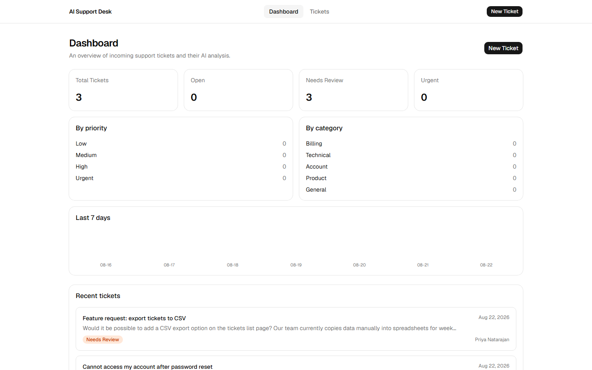
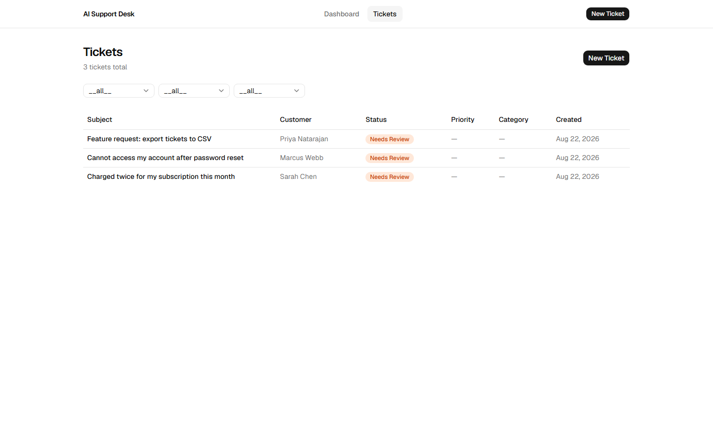
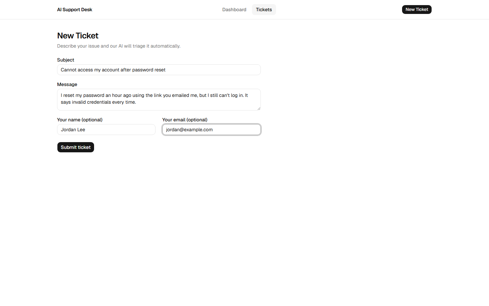
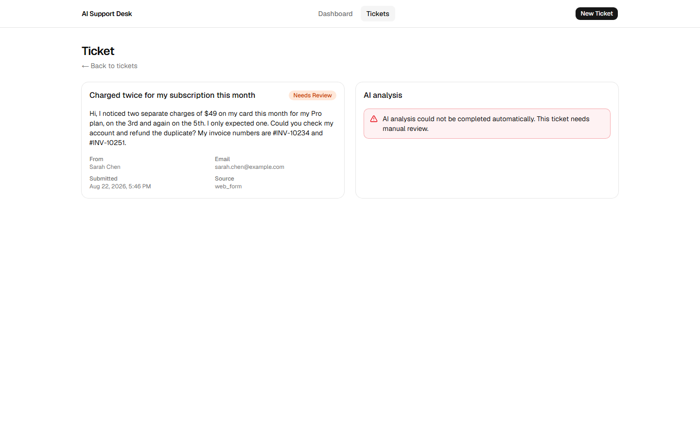
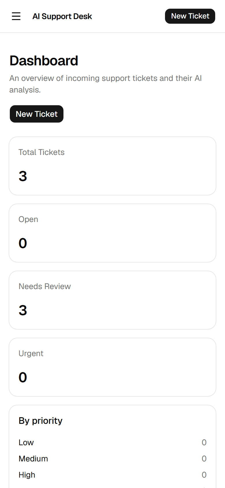
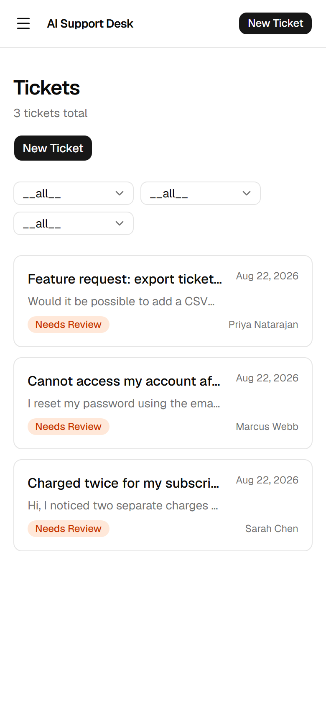

# AI Support Desk

AI Support Desk is a full-stack customer support ticketing app that triages every incoming ticket automatically: an LLM reads the subject and message and returns a category, a priority, a short summary, and a suggested reply — all persisted to Postgres and surfaced on a live dashboard. Built as a production-shaped MVP: real AI integration, real database, real deployment — no hardcoded or faked responses.

[](https://nextjs.org)
[](https://react.dev)
[](https://www.typescriptlang.org)
[](https://tailwindcss.com)
[](https://supabase.com)
[](https://platform.openai.com)
[](https://vercel.com)
[](#testing)

**Live demo:** **[ai-support-desk-gilt.vercel.app](https://ai-support-desk-gilt.vercel.app)**

> **A note on the live demo's AI results:** the deployed OpenAI account currently has no billing credits, so every ticket you create on the live demo will show a **"Needs Review"** badge instead of an AI category/priority/summary — that's the app's own graceful-degradation fallback (see [Fallback strategy](#fallback-strategy) below) working exactly as designed, not a bug. The ticket, the form validation, the dashboard, and the full request lifecycle all still run for real. The screenshots below were captured against this same live deployment.

---

## Screenshots

| Dashboard                                            | Tickets list                                               |
| ---------------------------------------------------- | ---------------------------------------------------------- |
|  |  |

| New ticket form                                             | Ticket detail                                                |
| ----------------------------------------------------------- | ------------------------------------------------------------ |
|  |  |

| Mobile — Dashboard                                            | Mobile — Tickets list                                               |
| ------------------------------------------------------------- | ------------------------------------------------------------------- |
|  |  |

A scripted walkthrough of the flow above is in [`docs/DEMO.md`](docs/DEMO.md).

---

## Features

- **AI ticket triage** — category (billing / technical / account / product / general), priority (low / medium / high / urgent), a 1–2 sentence summary, and a drafted reply, all in one structured-output call to `gpt-4o-mini`.
- **Dashboard** — total/open/needs-review/urgent stat cards, priority and category breakdowns, a 7-day trend chart, and a recent-tickets feed.
- **Ticket list** — filter by status, priority, and category; paginated.
- **Ticket detail** — original message side-by-side with the AI analysis.
- **Graceful AI degradation** — an AI failure never loses the customer's ticket; see [Fallback strategy](#fallback-strategy).
- **Full validation** — the same Zod schemas run client-side (for UX) and server-side (as the actual source of truth).
- **Responsive** — card-based mobile layouts, table layouts on desktop, down to 375px.
- **Security headers** — CSP, `X-Frame-Options`, `Referrer-Policy`, etc. on every response (dev/prod-aware CSP — see `next.config.ts`).
- **Per-IP rate limiting** on the one endpoint that spends real money (`POST /api/tickets`).

## Tech stack

| Layer      | Choice                                              | Why                                                                                                       |
| ---------- | --------------------------------------------------- | --------------------------------------------------------------------------------------------------------- |
| Framework  | Next.js 16 (App Router)                             | Frontend + API routes in one deployable unit; Server Components; zero-config on Vercel.                   |
| Language   | TypeScript (strict, `noUncheckedIndexedAccess`)     | Compile-time safety, paired with Zod for the runtime boundary an LLM response actually needs.             |
| UI         | Tailwind CSS 4 + shadcn/ui (Base UI primitives)     | Accessible, unstyled primitives + utility CSS — no heavyweight component library, fully ownable.          |
| Database   | Supabase (Postgres)                                 | Hosted Postgres with a generous free tier, RLS-ready, no infra to manage.                                 |
| AI         | OpenAI `gpt-4o-mini`, JSON Schema structured output | Cheapest tier with native structured-output enforcement; double-validated with Zod (belt and suspenders). |
| Validation | Zod                                                 | One schema shared by the client form and the server route handler.                                        |
| Testing    | Vitest (unit/integration) + Playwright (E2E)        | Fast ESM-native unit runner; real-browser E2E against a production build.                                 |
| Hosting    | Vercel                                              | Built by the Next.js team; zero-config deploys from `main`.                                               |

Full rationale for each choice is in [`PROJECT.md`](PROJECT.md) §6.

## Architecture

```
┌──────────────┐        ┌────────────────────┐        ┌──────────────┐
│   Next.js    │  --->  │  Next.js API        │  --->  │  OpenAI API  │
│   Frontend   │        │  Route Handlers     │        │ (gpt-4o-mini)│
│   (React)    │  <---  │  (server-side)      │  <---  │              │
└──────────────┘        └────────────────────┘        └──────────────┘
                                │      ▲
                                ▼      │
                         ┌─────────────────────┐
                         │      Supabase        │
                         │      (Postgres)      │
                         └─────────────────────┘
```

Everything lives in one Next.js project. The AI and database clients are server-only — `OPENAI_API_KEY` and `SUPABASE_SERVICE_ROLE_KEY` never reach the browser (enforced at build time via the `server-only` package; verified against the built client bundle before every deploy).

### Request lifecycle

```
1. User fills out the ticket form and submits
2. POST /api/tickets — Zod validates the input (400 on failure)
3. Ticket is INSERTed into Supabase (status: 'processing')
4. OpenAI is called for structured analysis (category/priority/summary/reply)
5. The AI response is re-validated with Zod (belt and suspenders on top of
   OpenAI's own json_schema `strict: true` enforcement)
6. The ticket row is UPDATEd with the analysis (status: 'open')
7. 201 + the complete ticket is returned; the client redirects to
   /tickets/[id]
```

### Fallback strategy

The ticket is written to the database _before_ the AI call — it can never be lost. If the AI call fails for any reason (timeout, rate limit after one retry, invalid API key, a response that doesn't pass Zod validation), the ticket is instead marked `needs_review` and the API still returns `201` with a `warning` field. The client shows a warning toast and the detail page renders a "needs manual review" banner instead of the analysis panel. Full decision table in [`PROJECT.md`](PROJECT.md) §11/§15.

## Getting started

```bash
git clone https://github.com/MMSolver/ai-support-desk.git
cd ai-support-desk
npm install
cp .env.example .env.local
```

Fill in `.env.local`:

| Variable                        | Where to get it                                                                                      |
| ------------------------------- | ---------------------------------------------------------------------------------------------------- |
| `NEXT_PUBLIC_SUPABASE_URL`      | Supabase project → Settings → API                                                                    |
| `NEXT_PUBLIC_SUPABASE_ANON_KEY` | Supabase project → Settings → API                                                                    |
| `SUPABASE_SERVICE_ROLE_KEY`     | Supabase project → Settings → API (**server-only, never commit**)                                    |
| `OPENAI_API_KEY`                | [platform.openai.com/api-keys](https://platform.openai.com/api-keys) (**server-only, never commit**) |
| `NEXT_PUBLIC_APP_URL`           | `http://localhost:3000` for local dev                                                                |

Create the `tickets` table (schema + indexes + trigger) using the SQL in [`PROJECT.md`](PROJECT.md) §10, run against your Supabase project.

```bash
npm run dev
```

Open [http://localhost:3000](http://localhost:3000).

## Testing

```bash
npm run typecheck    # tsc --noEmit, strict mode
npm run lint          # ESLint
npm run test          # Vitest — unit + integration (Zod schemas, AI parsing, API routes)
npm run test:coverage # Vitest with coverage
npm run test:e2e      # Playwright — builds a production bundle, then runs against it
```

`test:e2e` runs against real Supabase and real OpenAI (see `e2e/tickets.spec.ts`) — it accepts a successful analysis, a `needs_review` fallback, or a still-pending state as equally valid outcomes at the assertion point that follows ticket creation, so it doesn't flake on an occasional AI hiccup, an expired trial credit, or exhausted OpenAI quota.

## Deployment

Deployed on Vercel with zero extra config — Next.js is auto-detected, `npm run build` / `npm run start` are the build/start commands, and `package.json`'s `engines.node` (`>=20.9.0`, matching Next 16's own requirement) picks the right runtime.

1. Import the repo on [vercel.com/new](https://vercel.com/new).
2. Add the same five variables from `.env.local` under Project Settings → Environment Variables (set `NEXT_PUBLIC_APP_URL` to your production URL).
3. Push to `main` — Vercel builds and deploys automatically; every PR gets its own preview deployment.

## Project structure

```
src/
  app/                 # Routes (dashboard, tickets list/new/[id]) + API route handlers
  components/
    ui/                # shadcn/ui primitives
    dashboard/         # Stat cards, recent-tickets feed
    tickets/           # Form, list card, detail view, filters
    shared/            # Badges, empty/error states, page header
  lib/
    ai/                # Provider-agnostic AI service interface + OpenAI implementation
    db/                # Supabase clients (anon + service-role) and query functions
    validations/       # Zod schemas (shared by client and server)
    utils/             # Formatting, constants
e2e/                   # Playwright specs
```

Full architectural reference, including every design decision's rationale, database schema, and API contract: [`PROJECT.md`](PROJECT.md).

## License

[MIT](LICENSE)
